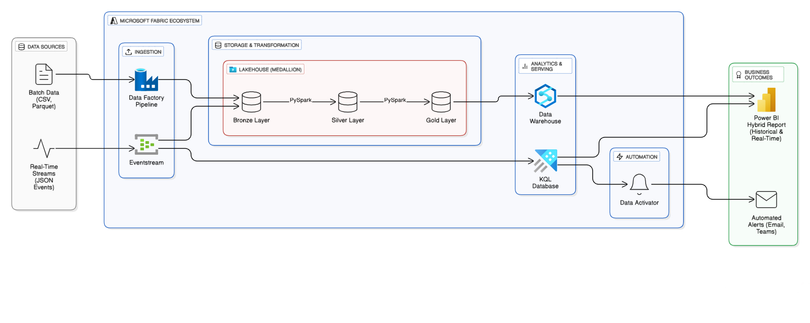

# Microsoft-Fabric-Retail-Analytics-Platform
An end-to-end retail analytics platform built in Microsoft Fabric, featuring a medallion architecture, real-time dashboards, and automated alerts.
---

## 1. Introduction

This project is a comprehensive, end-to-end retail analytics platform built entirely within the Microsoft Fabric ecosystem. It addresses the common business challenge of unifying historical batch data with real-time streaming data to create a single source of truth for decision-making.

## 2. Architecture

The solution follows a modern data platform architecture, ingesting both batch and real-time data, processing it through a medallion architecture, and serving it for BI and real-time alerting.



```mermaid
graph LR
    subgraph "Data Sources"
        A[Batch Data <br/>(CSV, Parquet)]
        B[Real-Time Streams <br/>(JSON Events)]
    end

    subgraph "Microsoft Fabric Ecosystem"
        subgraph "Ingestion"
            C[Data Factory Pipeline]
            D[Eventstream]
        end

        subgraph "Storage & Transformation"
            subgraph "Lakehouse (Medallion)"
                E[Bronze Layer] -->|PySpark| F[Silver Layer]
                F -->|PySpark| G[Gold Layer]
            end
        end

        subgraph "Analytics & Serving"
            H[Data Warehouse]
            I[KQL Database]
        end

        subgraph "Automation"
            J[Data Activator]
        end
    end

    subgraph "Business Outcomes"
        K[Power BI Hybrid Report <br/>(Historical & Real-Time)]
        L[Automated Alerts <br/>(Email, Teams)]
    end

    %% --- Data Flow Connections ---
    A --> C --> E
    B --> D
    D --> E
    D --> I

    G --> H

    H --> K
    I --> K

    I --> J
    J --> L
```


## 3. Tech Stack

- **Data Ingestion:** Data Factory, Eventstream
- **Storage & Processing:** OneLake, Lakehouse (Medallion Architecture), PySpark
- **Serving & Analytics:** Data Warehouse, KQL Database, Power BI
- **Automation:** Data Activator

## 4. Key Features

- **Hybrid Data Ingestion:** Handles both batch (CSV, Parquet) and real-time (JSON streams) data sources.
- **Medallion Architecture:** Data is systematically processed through Bronze (raw), Silver (cleaned), and Gold (aggregated) layers.
- **Advanced Transformations:** Includes a PySpark UDF for real-time sentiment analysis on social media text.
- **Hybrid Power BI Report:** A single report combines deep-dive historical analysis from the Data Warehouse with a live, auto-refreshing dashboard powered by the KQL Database.
- **Proactive Alerting:** Uses Data Activator to automatically send notifications based on real-time business KPIs (e.g., a sudden drop in website traffic).

## 5. Contact

Connect with me on [LinkedIn]([linkedin.com/in/manoj-k-498b70124](https://www.linkedin.com/in/manoj-k-498b70124?lipi=urn%3Ali%3Apage%3Ad_flagship3_profile_view_base_contact_details%3BNMbihSQSS3aCZaT1eSasjw%3D%3D))!
